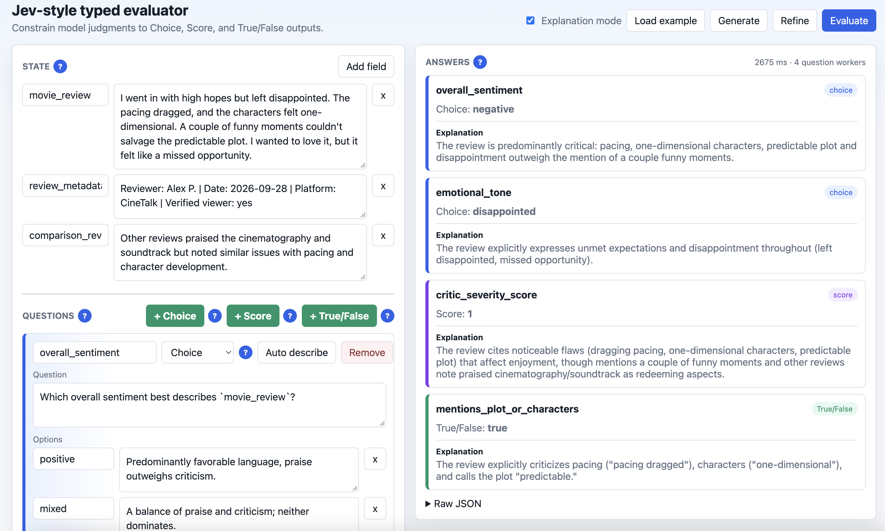
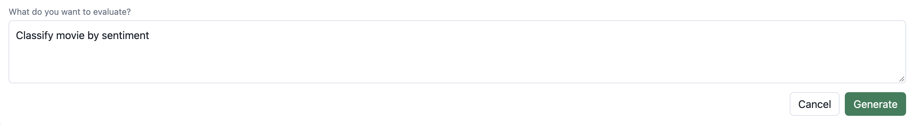
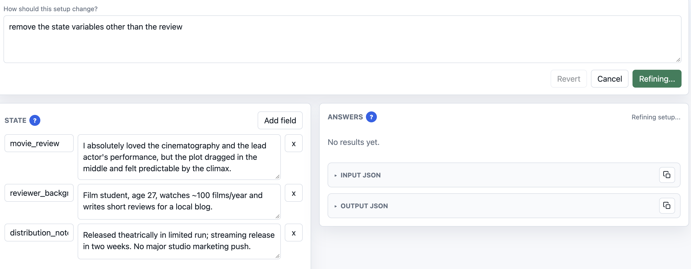

# Explanable Jev

A small local evaluator inspired by TypeSafe Jev. It lets you define shared `state`, ask several typed questions against that state, and returns constrained answers: `choice`, `score`, or `true/false`.



Inspiration: [Introducing System One Models and Jev](https://typesafe.ai/blog/introducing-system-one-models-and-jev).

The default LLM adapter uses OpenAI `gpt-5-mini`, but model access is isolated behind `llm.py` so you can swap in another provider.

## Run

```bash
python3 server.py
```

Open:

```text
http://127.0.0.1:8000
```

The app reads `OPENAI_API_KEY` from `.env` or the environment. Optional settings:

```env
OPENAI_MODEL=gpt-5-mini
OPENAI_REASONING_EFFORT=minimal
PORT=8000
```

`OPENAI_REASONING_EFFORT` is passed to OpenAI's Responses API as `reasoning.effort`.

## UI Workflow

The browser UI has two main panes:

- **State**: key-value fields that every question can reference, such as `ticket_message`, `refund_policy`, `movie_review`, or `review_metadata`.
- **Questions**: typed judgments against that state. The supported question types are Choice, Score, and True/False.
- **Answers**: normalized typed outputs, optional explanations, and collapsed Input/Output JSON blocks with copy controls.

Use **Generate** to describe the evaluator you want in a sentence or two. The app asks the configured LLM to generate editable state fields and 3 to 5 typed questions.



Use **Refine** to change the current setup with a short instruction. The app sends the current state and questions to the LLM, applies the requested refinement, validates the result, and reloads it into the editable UI. After a successful refinement, **Revert** restores the previous setup if you do not like the change.



Use **Auto describe** on an individual question to fill in concise option or rubric descriptions.

Generated and refined setups follow two extra rules:

- Generated state keys may use any name except `input_text` and `input`.
- Every generated/refined question instruction must explicitly refer to at least one state key, preferably with backticks, such as `` `ticket_message` ``.

## Request Shape

The browser builds requests from the editable state table and question cards. Conceptually, `/api/evaluate` receives:

```json
{
  "state": {
    "ticket_message": "I was charged twice. Please refund the duplicate.",
    "refund_policy": "Duplicate charges are eligible for refund after verification."
  },
  "explanationMode": true,
  "questions": {
    "refund_requested": {
      "type": "true/false",
      "instructions": "Does `ticket_message` request a refund?",
      "criteria": {
        "true": "The message asks for money back or reversal.",
        "false": "The message does not ask for a refund."
      }
    },
    "department": {
      "type": "choice",
      "instructions": "Which team should handle `ticket_message`?",
      "criteria": {
        "billing": "Payments, invoices, refunds, or duplicate charges.",
        "technical": "Bugs, outages, errors, or integrations.",
        "returns": "Exchanges, damaged items, or wrong items."
      }
    },
    "frustration": {
      "type": "score",
      "instructions": "How frustrated is the customer in `ticket_message`?",
      "criteria": ["Calm", "Frustrated", "Very angry"]
    }
  }
}
```

## Output Shape

Each question is evaluated independently and normalized into a predictable typed answer:

- `choice`: returns one declared option key.
- `score`: returns a number clamped to the declared score range, plus a legend.
- `true/false`: returns `true` or `false`.

The Answers pane includes two collapsed, copyable JSON blocks. Click a block to expand or collapse it, or use the clipboard icon in the top-right of the block to copy its JSON:

- **Input JSON**: the exact request payload assembled from the current editor. It is available before evaluation and updates as you edit.
- **Output JSON**: the compact question-to-answer result after evaluation.

With explanation mode enabled, answers also include a short explanation. Output JSON looks like:

```json
{
  "refund_requested": {
    "answer": true,
    "explanation": "The customer explicitly asks to refund the duplicate charge."
  },
  "department": {
    "answer": "billing",
    "explanation": "The ticket is about duplicate payment and refund handling."
  },
  "frustration": {
    "answer": 1,
    "explanation": "The customer is concerned but not abusive."
  }
}
```

## Generation Endpoints

`/api/generate` powers the **Generate** button:

```json
{
  "description": "Classify support tickets by urgency, team, and refund eligibility."
}
```

`/api/refine` powers the **Refine** button:

```json
{
  "instruction": "Add a compliance question and make urgency a 5-point score.",
  "current": {
    "state": {},
    "questions": {}
  }
}
```

Both endpoints ask the LLM for JSON containing `state` and `questions`, then validate the result before returning it to the browser.

If generated JSON is invalid or fails validation, the server sends the failed output and exact validation error back to the LLM for repair, up to 3 total attempts.

## Description Generation

`/api/describe` fills in option descriptions for one existing question. It receives a question type, question text, option keys, and current state, then asks the LLM for plain-text lines:

```text
billing: Payments, duplicate charges, invoices, and refunds.
returns: Exchanges, wrong sizes, damaged items, and returns.
```

The server parses those lines and writes them back into the criteria fields.

## Evaluation Behavior

Evaluation prompts are intentionally compact plain text, not JSON. For example:

```text
State:
ticket_message: refund duplicate

Q: Which team should handle `ticket_message`?
Answer this MCQ with exactly one option token. Options: a) billing: payments; b) returns: exchanges. Return token only.
```

The LLM is not asked for probabilities or confidence scores. The server:

- interprets plain answers like `a`, `1`, or `t`
- retries with a short repair prompt if the answer cannot be parsed
- clamps answers to the declared type and allowed range
- runs separate questions in parallel

## Swapping The LLM

Edit `llm.py` and keep this function signature:

```python
def llm(system_prompt: str, user_prompt: str) -> str:
    return "..."
```

The rest of the app only expects a string response. `server.py` handles interpretation, validation, post-processing, and retries.
